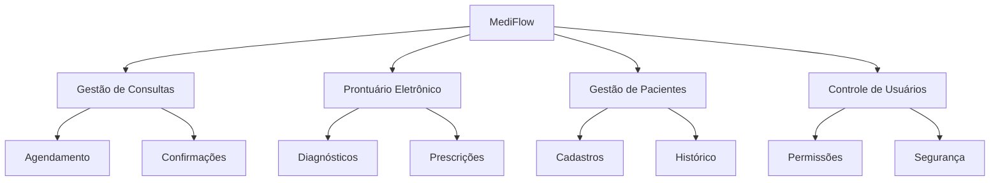
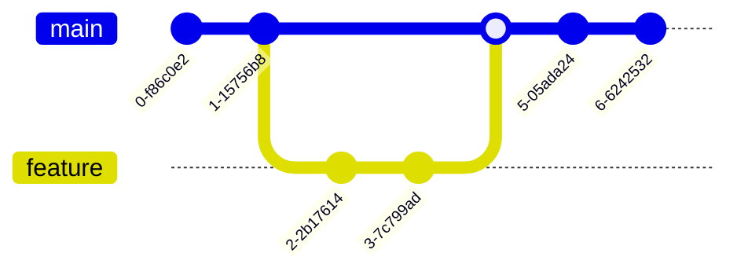

<div align="center">

<!-- Título animado em ASCII art -->
```
███╗   ███╗███████╗██████╗ ██╗███████╗██╗      ██████╗ ██╗    ██╗
████╗ ████║██╔════╝██╔══██╗██║██╔════╝██║     ██╔═══██╗██║    ██║
██╔████╔██║█████╗  ██║  ██║██║█████╗  ██║     ██║   ██║██║ █╗ ██║
██║╚██╔╝██║██╔══╝  ██║  ██║██║██╔══╝  ██║     ██║   ██║██║███╗██║
██║ ╚═╝ ██║███████╗██████╔╝██║██║     ███████╗╚██████╔╝╚███╔███╔╝
╚═╝     ╚═╝╚══════╝╚═════╝ ╚═╝╚═╝     ╚══════╝ ╚═════╝  ╚══╝╚══╝ 
```

<h3>🏥 Sistema Inteligente de Gestão para Clínicas Médicas</h3>

<!-- Badges modernos e elegantes -->
<div align="center">
  
[](https://www.python.org/)
[](https://www.sqlite.org/)
[](LICENSE)
[](https://github.com/KerubinDev/MediFlow)

</div>

<!-- Menu de navegação estilizado -->
<p align="center">
  <a href="#-visão-geral">📋 Visão Geral</a> • 
  <a href="#-recursos">🌟 Recursos</a> • 
  <a href="#-tecnologias">🛠️ Tecnologias</a> • 
  <a href="#-começando">🚀 Começando</a> • 
  <a href="#-demonstração">🎥 Demonstração</a>
</p>

</div>

<!-- Seção de Visão Geral com Design Moderno -->
## 📋 Visão Geral

<div align="center">



</div>

O **MediFlow** representa uma revolução na gestão de clínicas médicas, combinando eficiência operacional com uma experiência excepcional para usuários e pacientes.

<!-- Cards de Recursos -->
## 🌟 Recursos

<table align="center">
  <tr>
    <td align="center">
      
      <br/><strong>Gestão de Consultas</strong>
      <br/>Sistema inteligente de agendamento
    </td>
    <td align="center">
      
      <br/><strong>Prontuários Digitais</strong>
      <br/>Documentação clínica completa
    </td>
    <td align="center">
      
      <br/><strong>Gestão de Pacientes</strong>
      <br/>Perfis detalhados e histórico
    </td>
  </tr>
</table>

<!-- Seção de Tecnologias com Visual Diferenciado -->
## 🛠️ Stack Tecnológica

<div align="center">

| Back-end | Front-end | Database | Tools |
|----------|-----------|----------|--------|
|  |  |  |  |
|  |  |  |  |
|  |  | |  |

</div>

<!-- Seção de Instalação com Destaque -->
## 🚀 Começando

```bash
# Clone este repositório
git clone https://github.com/KerubinDev/MediFlow.git

# Navegue até o diretório
cd MediFlow

# Instale as dependências
pip install -r requirements.txt

# Inicie o servidor
python run.py
```

<!-- Seção de Credenciais Estilizada -->
## 🔐 Credenciais de Acesso

<div align="center">

| Perfil | Credenciais | Permissões |
|--------|-------------|------------|
| 👑 **Admin** | admin@medflow.com<br>admin123 | Acesso total ao sistema |
| 👨‍⚕️ **Médico** | medico@medflow.com<br>medico123 | Prontuários e consultas |
| 💼 **Recepção** | recepcao@medflow.com<br>recepcao123 | Agendamentos |

</div>

<!-- Estrutura do Projeto com Ícones -->
## 📂 Estrutura do Projeto

```plaintext
🏥 MediFlow/
├── 📱 frontend/
│   ├── 🎨 assets/
│   ├── 📄 templates/
│   └── 🎯 static/
├── ⚙️ backend/
│   ├── 📊 models/
│   ├── 🛣️ routes/
│   └── 🔧 utils/
├── 🔒 config/
└── 📚 docs/
```

<!-- Seção de Contribuição com Workflow -->
## 🤝 Como Contribuir



1. Fork o projeto
2. Crie sua Feature Branch (`git checkout -b feature/AmazingFeature`)
3. Commit suas mudanças (`git commit -m 'Add: nova funcionalidade'`)
4. Push para a Branch (`git push origin feature/AmazingFeature`)
5. Abra um Pull Request

<!-- Seção do Autor com Cartão de Perfil -->
## 👨‍💻 Autor

<div align="center">
  
  <h3>Kelvin Moraes</h3>
  <p>Full Stack Developer</p>
  
[](https://github.com/KerubinDev)
[](mailto:kelvin.moraes117@gmail.com)
</div>

---

<div align="center">
  
  **[⬆ Voltar ao topo](#mediflow)**

  <sub>Desenvolvido com 💙 por Kelvin Moraes</sub>
  
  [](https://flask.palletsprojects.com/)
</div>
